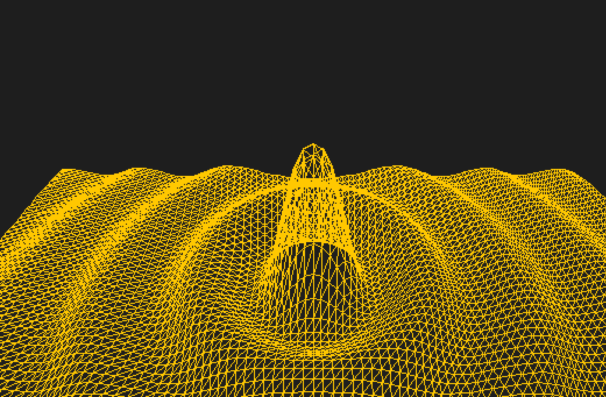

# GeoGebra klón - GeoCopy

## Felhasználói kézikönyv

### Program céljának rövid leírása:

A GeoCopy a GeoGebra nevezetű szoftver térbeli változatának a másolata. Ez a másolat többek között képes egy beírt függvényt ábrázolni. Emellett képes tetszőleges egyenesek, pontok, gömbök ábrázolására is. Ez segíthet vizualizálni a függvényeket, esetleg megérteni az egymáshoz való viszonyukat.

Például itt ez az  `y=10*sin((x^2+z^2)^(1/2))/((x^2+z^2)^(1/2))` függvény ábrázolva:


### Használati útmutató:

A program az ablak fölső részén, a menü alatt rendelkezik egy parancssorral, ahova a parancsokat várja. Jelenleg a program a következő parancsokat tudja értelmezni (a „: név” minden esetben elhagyható):

- `tengely=kifejezés : név` – ahol a tengely az x,y,z tengely valamelyikét jelenti,
    és a kifejezés alatt olyan karakter-sorozat értendő, melyben csak E, Pi, számok, műveletek (+,-,*,/,^), zárójelek, sin, cos függvények és szóközök szerepelhetnek. Ez a  függvények/síkok ábrázolásához szükséges parancs.
- `point x y z : név`– Ez a parancs a tér (x,y,z) pontjába helyez egy pontot.


- `line x1 y1 z1 x2 y2 z2` – Az egyeneseket a program úgy hozza létre, hogy azokat ráilleszti két pontra, ebben az esetben az első pont az (x1,y1,z1), és a második pont  az (x2,y2,z2).
- `line p1 p2` – Ha p1 és p2 nevű pontok léteznek, akkor a program képes rájuk
    ráilleszteni egy egyenest.
- `sphere x y z r` – Felvesz egy (x,y,z) középpontú gömböt, melynek a sugara r.
- `sphere p1 r` – Ha p1 nevű pont létezik, akkor ennek a parancsnak a hatására a
    program felvesz egy p1 középpontú r sugarú gömböt.
- `set length|width|height n` – Beállítja, hogy melyik tengely mentén hány
    háromszöget rajzoljon ki a program a függvényeknél, és a síkoknál. A „length” esetében a z, a „width” esetében az x, és a „height” esetében az y tengely mentén kirajzolt háromszögek száma változik „n”- re.
- `set stepSize n` – Megváltoztatja a lépésméretet n-re. A lépésméret szabja meg azt, hogy egy függvénynek milyen gyakran, mekkora egységenként rajzolódik ki egy pontja.
    Például ha az y=sinx függvényt ábrázolja a program, és a lépésméretet közel PI-re állítjuk, akkor csak pi többszöröseinél rajzol ki a program új pontot.
- `set filled true|false` – Megváltoztatja, hogy a program teli háromszögeket
    rajzol ki, vagy csak a háromszög oldalait rajzolja ki. Alapbeállításban „false”-ra van állítva.

A program rendelkezik egy panellal, ami a 3D-s teret jeleníti meg (egy „kamera” szemszögéből), és ahol a parancsokkal létrehozott entitások megjelenítésre kerülnek. A kamerát, amin keresztül a teret látjuk, irányíthatjuk is. Ez az irányítás billentyű lenyomásokkal történik. (Minden esetben a megfelelő gomb lenyomására a kamera egy egységnyit mozog valamilyen irányban, vagy 1 fokkal fordul el valamelyik tengely körül.) A kamera irányításának billentyűi a következők:

- W – Ennek hatására a kamera a z tengely mentén mozdul el a pozitív irányba.
- S – Ennek lenyomására a kamera a z tengely mentén a negatív irányban mozdul el.
- A – Lenyomása után a kamera az x tengely mentén negatív irányba mozdul el.
- D – Lenyomása után a kamera az x tengely mentén a pozitív irányba mozdul el.
- U – Lenyomására a kamera az y tengely mentén mozdul el a pozitív irányba.
- J – Lenyomására a kamera az y tengely mentén mozdul el a negatív irányba.

A kamera forgatásának billentyűi:

- Q – y tengely körül 1 fokkal fordul el a kamera
- E – y tengely körül -1 fokkal fordul el a kamera
- R – x tengely körül 1 fokkal fordul el a kamera
- F – x tengely körül -1 fokkal fordul el a kamera
- Y – z tengely körül 1 fokkal fordul el a kamera
- X – z tengely körül -1 fokkal fordul el a kamera

Az ablak bal oldalán található egy panel, melyben fel van sorolva az összes entitás melyet megjelenítünk. Mindegyik felsorolt elemhez tartozik egy szöveges rész, melyben szerepel az entitás parancsa/függvénye, amit átírhatunk, ezzel megváltoztatva azt. Emellett mindegyik elemhez tartozik egy szín (alapértelmezésben a zöld), amit egy felsorolásból kiválasztva lehet megváltoztatni. Az elemekhez tartozik egy `Delete` gomb is, mely a megnyomása után kitörli a megfelelő entitást. Egyszerre a program maximum 10 entitást képes megjeleníteni.

A program rendelkezik egy menüvel is, melyben 3 menüpont van. Sorban: `Save`, `Save as`, `Load`. A `Save` menüpont kiválasztása után a program kiírja egy szöveges fájlba (ami .gkk-ra végződik) a kamera pozícióját, majd az összes megjelenített entitás parancsát, oly módon, hogy minden parancs egy új sorba kerüljön. Ezt követően parancs formájában külön sorokba kiírja azt, hogy az x, y, és a z tengely mentén hány háromszöget rajzol ki a program, majd azt hogy teli háromszögeket rajzol-e ki a program, és végül azt, hogy mekkora a lépésméret. Erre példa:

```
0 0 0
y=(25-x^2-z^2)^(1/2) : function
set width 50
set height 50
set length 50
set stepSize 1.
set filled false
```

A `Save` esetén a program az állapotot egy` „klon” + szam + „.ggk”` nevű fájlba menti el, abban könyvtárban, ahonnan a programot indították. A „szam” értéke 0-ról indul, és addig nő ameddig nem tudja a program úgy kiírni az új fájlt, hogy azzal ne írjon semmit felül.

A `Save as` opció a `Save`-hez hasonlóan menti el a program állapotát, azzal a különbséggel, hogy mentés elött feljön egy mentési dialógus, amiben ki lehet választani, hogy hova, és milyen néven szeretnénk menteni.

A `Load` opció a `Save as`-hez hasonlóan egy új ablakot nyit meg, melyben ki tudjuk választani mely mappából mely fájlt szeretnénk megnyitni, és az abban szereplő információt betölteni.

### Dokumentáció

A program dokumentációja megtalálható a forráskódban JavaDoc kommentekként.

### Letöltés

A programot .jar fájl-ként lehet letölteni.
<a href="https://github.com/Coldus12/Prog3HF/releases/download/v1.1/GeoCopy.jar" download>Letöltéshez kattints ide!</a>
